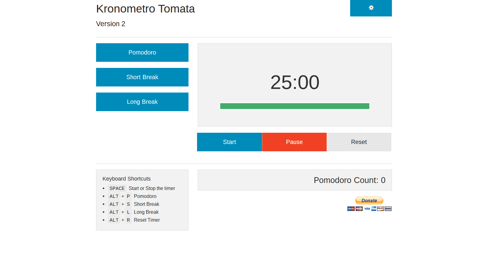
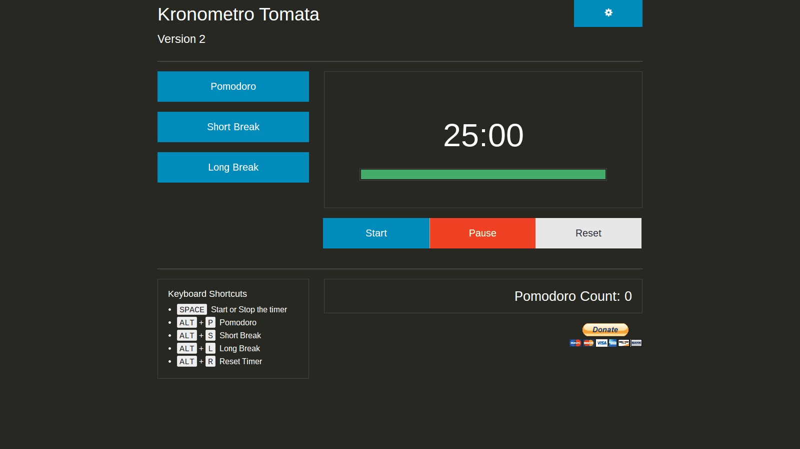
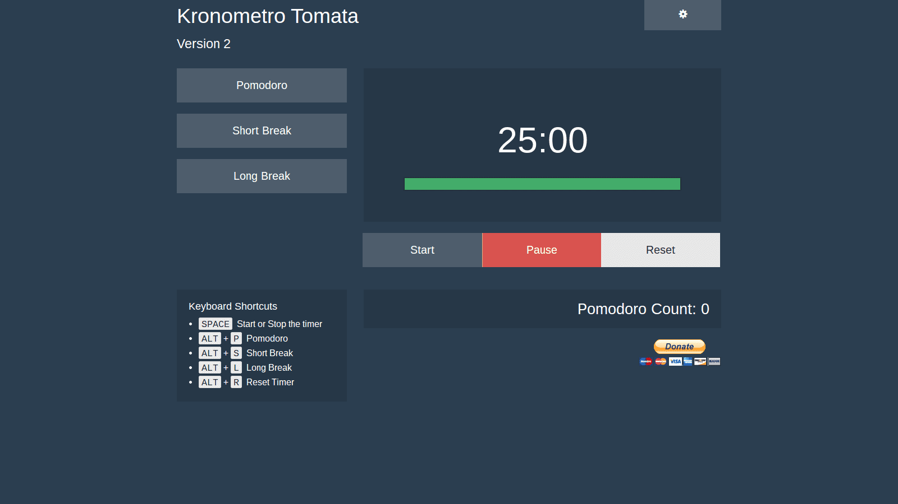

# Kronometro Tomata Version 2
V.2 is an update to foundation 5.5.0, and a new theme mask technique.

At the moment 5.5.0 has an issue with reveal modal background being absolute when it needs to be fixed.

## Theme Mask
The new theme masks are very small (dark.css is 1.3kB and dark.min.css is 751bytes).
By not making the browser rerender a 100kB+ file each time a theme is changed, switching
is fast and use less bandwidth. Themes are also easier to maintain.

Foundation.css defines the base style for all elements, we don't need to duplicate all that work.
###### Founfation.css
```css
.progress {
  background-color: #F6F6F6;
  height: 1.5625rem;
  border: 1px solid white;
  padding: 0.125rem;
  margin-bottom: 0.625rem; }
  .progress .meter {
  background: #008CBA; /*so on and so on*/
```

Just address the items that you would like to change. This is all that is needed to theme the progress bar element.
###### dark.css
```css
.progress {
  background-color: transparent;
  border: 1px solid #444; }
```
### Light

Light is the default Foundation css
### Dark

A dark version of the Light theme and great for night time use.
### Hero

Hero is inspired by [Superhero - Bootswatch](http://bootswatch.com/superhero/).